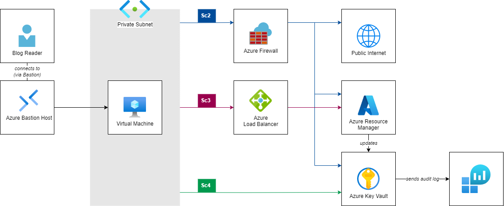

# Routing options for VMs without Default Outbound Internet Access (from Private Subnets)

Virtual Machines deployed in Azure used to have _Default Outbound Internet Access_. Until today, this allows virtual machines to connect to resources on the internet (including public endpoints of Azure PaaS services) even if the Cloud administrators have not configured any outbound connectivity method for their virtual machines explicitly. Implicitly,  Azure's network stack performed source network address translation (SNAT) with a public IP address that was provided by the platform. 

<br/>

As part of their commitment to increase security on customer workloads, Microsoft will deprecate _Default Outbound Internet Access_ on 30 September 2025 (see the official announcement [here](https://azure.microsoft.com/en-us/updates/default-outbound-access-for-vms-in-azure-will-be-retired-transition-to-a-new-method-of-internet-access/)). As of this day, customers will need to configure an outbound connectivity method explicitly if their virtual machine requires internet connectivity. Customers will have the following options: 

<br/>

- Attach a dedicated [Public IP Address](https://learn.microsoft.com/en-us/azure/virtual-network/ip-services/associate-public-ip-address-vm?tabs=azure-portal) to a virtual machine.
- Deploy a [NAT gateway](https://learn.microsoft.com/en-us/azure/nat-gateway/nat-overview) and attach it to the VNet subnet the VM is connected to.
- Deploy a Load Balancer and configure [Load Balancer Outbound Rules](https://learn.microsoft.com/en-us/azure/load-balancer/outbound-rules) for virtual machines.
- Deploy a Network Virtual Appliance (NVA) to perform SNAT, such as [Azure Firewall](https://learn.microsoft.com/en-us/azure/firewall/overview), and [route](https://learn.microsoft.com/en-us/azure/virtual-network/virtual-networks-udr-overview#custom-routes) internet-bound traffic to the NVA before egressing to the internet.

<br/>

Today, customers can start preparing their workloads for the updated platform behavior. By setting [property `defaultOutboundAccess`](https://learn.microsoft.com/en-us/rest/api/virtualnetwork/subnets/create-or-update?view=rest-virtualnetwork-2024-01-01&tabs=HTTP#request-body) to `false` during subnet creation, VMs deployed to this subnet will not benefit from the conventional default outbound access method, but adhere to the new conventions. Subnets with this configuration are also referred to as 'private subnets'.

<br/>

In this article, we are demonstrating (a) the limited connectivity of virtual machines deployed to private VNets. We are also exploring different options to (b) route traffic from these virtual machines to public internet and to (c) optimize the communication path for management and data plane operations targeting public endpoints of Azure services.

<br/>

> :point_up: We will be focusing on connectivity with Azure services' _public_ endpoints. If you use [Private Endpoints](https://learn.microsoft.com/en-us/azure/private-link/private-endpoint-overview) to expose services to your virtual network instead, routing in a private subnet remains unchanged.

<br/>

## Overview

The following architecture diagram presents the sample setup that we'll use to explore the network traffic with different components. 


<br/>

The setup comprises following components:
- A virtual network with a private subnet (i.e., a subnet that does not offer default outbound connectivity to the internet).
- A virtual machine (running Ubuntu Linux) connected to this subnet.
- A Key Vault including a stored secret as sample Azure PaaS service to explore Azure-bound connectivity.
- A Log Analytics Workspace, storing audit information (i.e., metadata of all control and data plane operations) from that Key Vault.
- A Bastion Host to securely connect to the virtual machine via SSH.

<br/>

In the following sections, we will integrate following components to control the network traffic and explore the effects on communication flow:

<br/>

- An Azure Firewall as central Network Virtual Appliance to route outbound internet traffic.
- An Azure Load Balancer with Outbound Rules to route Azure-bound traffic through the Azure Backbone (we'll use the Azure Resource Manager in this example).
- A Service Endpoint to route data plane operations directly to the service.

<br/>

We'll use following examples to illustrate the communication paths:
- A simple http-call to `ifconfig.io` which (if successful) will return the public IP address that will be used to make calls to public internet resources.
- An invocation of the Azure CLI to get Key Vault metadata (`az keyvault show`), which (if successful) will return information about the Key Vault resources. This call to the Azure Resource Manager represents a management plane operation.
- An invocation of the Azure CLI to get a secret stored in the Key Vault (`az keyvault secret show`), which (if successful) will return a secret stored in the Key Vault. This represents a data plane operation.
- A query to the Key Vault's audit log (stored in the Log Analytics Workspace), to reveal the IP address of the caller for management and data plane operations. 

<br/>

# Prerequisites

The repository [Azure-Samples/azure-networking_private-subnet-routing](https://github.com/Azure-Samples/azure-networking_private-subnet-routing) on GitHub contains all required Infrastructure as Code assets, allowing you to easily reproduce the setup and exploration in your own Azure subscription. 

<br/>

## Tools

The implementation uses the following tools:
- `bash` as Command Line Interpreter (consider using [Windows Subsystem for Linux](https://learn.microsoft.com/en-us/windows/wsl/) if you are on Windows)
- `git` to clone the repository (find installation instructions [here](https://git-scm.com/downloads))
- Azure Command-Line Interface to interact with deployed Azure components (find installation instructions [here](https://learn.microsoft.com/en-us/cli/azure/install-azure-cli))
- HashiCorp Terraform (find installation instructions [here](https://developer.hashicorp.com/terraform/install?product_intent=terraform)).
- `jq` to parse and process JSON input (find installation instructions [here](https://jqlang.github.io/jq/download/))

<br/>

## Git repository

- Clone the Git repository from and change into its repository root.
  ```
  $ git clone https://github.com/Azure-Samples/azure-networking_private-subnet-routing
  $ cd azure-networking_private-subnet-routing
  ```

<br/>

## Azure subscription

- Login to your Azure subscription via Azure CLI and ensure you have access to your subscription.
  ```
  $ az login
  
  $ az account show
  ```

<br/>

# Getting ready: Deploy infrastructure.

We kick off our journey by deploying the infrastructure depicted in the architecture diagram above; we'll do that using the IaC (Infrastructure as Code) assets from the repository.

<br/>

- Open file `terraform.tfvars` in your favorite code editor, and adjust the values of variables `location` (the region to which all resource will be deployed) and `prefix` (the shared name prefix for all resources). Also don't forget to provide login credentials for your VM by setting values for `admin_username` and `admin_password`.

- Set environment variable `ARM_SUBSCRIPTION_ID` to point terraform to the subscription you are currently logged on to.
  ```
  $ export ARM_SUBSCRIPTION_ID=$(az account show --query "id" -o tsv)
  ```

- Using your CLI and terraform, deploy the demo setup:
  ```
  $ terraform init
    Initializing the backend...
    [...]
    Terraform has been successfully initialized!

  $ terraform apply
    [...]
    Do you want to perform these actions?
    Terraform will perform the actions described above.
    Only 'yes' will be accepted to approve.
      Enter a value: yes
    [...]

    Apply complete!
    [...]
  ```

  > :point_up: In case you are not familiar with Terraform, [this tutorial](https://developer.hashicorp.com/terraform/tutorials/azure-get-started/azure-build) might be insightful for you.

- Explore the deployed resources in the Azure Portal. Note that although the network infrastructure components shown in the architecture drawing above are already deployed, they are not yet configured for use from the Virtual Machine:
  - The Azure Firewall is deployed, but the route table attached to the VM subnet does not (yet) have any route directing traffic to the firewall (we will add this in Scenario 2). 
  - The Azure Load Balancer is already deployed, but the virtual machine is not yet member of its backend pool (we will change this in Scenario 3).

- Log in to the Virtual Machine using the Bastion Host.
  ```
  $ ./ssh-bastion.sh
  azureuser@localhost's password:
  Welcome to Ubuntu 20.04.6 LTS (GNU/Linux 5.15.0-1064-azure x86_64)
  azureuser@no-doa-demo-vm:~$
  ```

# Scenario 1: Access from private subnet.

At this point, our virtual machine is deployed to a private subnet. As we do not have any outbound connectivity method set up, all calls to public internet resources as well as to the public endpoints of Azure resources will time out. 

- Test 1: Call to public internet
  ```
  $ curl ifconfig.io --connect-timeout 10
  curl: (28) Connection timed out after 10004 milliseconds
  ```

- Test 2: Call to Azure Resource Manager
  ```
  $ curl https://management.azure.com/ --connect-timeout 10
  curl: (28) Connection timed out after 10001 milliseconds
  ```

- Test 3: Call to Azure Key Vault (data plane)
  ```
  $ curl https://no-doa-demo-kv.vault.azure.net/ --connect-timeout 10
  curl: (28) Connection timed out after 10002 milliseconds
  ```

# Scenario 2: Route all traffic through azure Firewall.

Typically, customers deploy a central Firewall in their network to ensure all outbound traffic is consistently SNATed through the same public IPs and all outbound traffic is centrally controlled and governed. In this scenario, we therefore modify our existing route table and add a default route (i.e., for CIDR range `0.0.0.0/0`), directing all outbound traffic to the private IP of our Azure Firewall.

- Add Firewall and routes.
  - Browse to `network.tf`, uncomment the definition of `azurerm_route.default-to-firewall`.
  - Update your deployment.
    ```
    $ terraform apply 
      Terraform will perform the following actions:
        # azurerm_route.default-to-firewall will be created
      [...]
    ```

- Test 1: Call to public internet, revealing that outbound calls are routed through the firewall's public IP.
  ```
  $ curl ifconfig.io
  4.184.163.38
  ```

- Now that you have access to the internet, install [Azure CLI](https://learn.microsoft.com/en-us/cli/azure/install-azure-cli-linux?pivots=apt).
  ```
  $ curl -sL https://aka.ms/InstallAzureCLIDeb | sudo bash
  ```

- Login to Azure with the Virtual machine's [managed identity](https://learn.microsoft.com/en-us/entra/identity/managed-identities-azure-resources/overview).
  ```
  $ az login --identity 
  ```

- Test 2: Call to Azure Resource Manager (you might need to change the Key Vault name if you changed the prefix in your `terraform.tfvars`)
  ```
  $ az keyvault show --name "no-doa-demo-kv" -o table
  Location            Name            ResourceGroup
  ------------------  --------------  --------------
  germanywestcentral  no-doa-demo-kv  no-doa-demo-rg
  ```

- Test 3: Call to Azure Key Vault (data plane)
  ```
  $ az keyvault secret show --vault-name "no-doa-demo-kv" --name message -o table
  ContentType    Name     Value
  -------------  -------  -------------
                 message  Hello, World!
  ```

- Query Key Vault Audit Log. 

  > :point_up: The ingestion of audit logs into the Log Analytics Workspace might take some time. Please make sure to wait for up to ten minutes before starting to troubleshoot.

  - Get Application ID of VM's system-assigned managed identity:
    ```
    $ ./scripts/vm_get-app-id.sh
    AppId for Principal ID f889ca69-d4b0-45a7-8300-0a88f957613e is: 8aa9503c-ee91-43ee-96c7-49dc005ebecc
    ```
  
  - Go to Log Analytics Workspace, run the following query.
    ```
    AzureDiagnostics | 
    where identity_claim_appid_g == "[Replace with App ID!]" 
    | project TimeGenerated, Resource, OperationName, CallerIPAddress 
    | order by TimeGenerated desc
    ```

    Alternatively, run the prepared script `kv_query-audit.sh`:
    ```
    $ ./scripts/kv_query-audit.sh
    CallerIPAddress    OperationName    Resource       TableName      TimeGenerated
    -----------------  ---------------  --------------  -------------  ----------------------------
    4.184.163.38       VaultGet         NO-DOA-DEMO-KV  PrimaryResult  2024-06-14T08:25:29.4821689Z
    4.184.163.38       SecretGet        NO-DOA-DEMO-KV  PrimaryResult  2024-06-14T08:26:07.0067419Z
    ```

> :point_up: Note that both calls to the Key Vault succeed as they are routed through the central Firewall; both requests (to Azure Management plane and Key Vault data plane) hit their endpoints with the Firewall's public IP.


# Scenario 3: Bypass Firewall for traffic to Azure management plane.

At this point all, internet and Azure-bound traffic to public endpoints is routed through the Azure Firewall. Although this allows you to centrally control all traffic, you might have good reasons to prefer to offload some communication from this component by routing traffic targeting a specific IP address range through a different component for SNAT -- for example to optimize latency or reduce load on the firewall component for communication with well-known hosts.

<br/>

> :point_up: As mentioned before, dedicated Public IP addresses, NAT Gateways and Azure Load Balancers are alternative options to configure SNAT for outbound access. You can find a detailed discussion about all options [here](https://learn.microsoft.com/en-us/azure/load-balancer/load-balancer-outbound-connections).

<br/>

In this scenario, we assume that we want network traffic to the Azure Management plane to bypass the central Firewall (we pick this service for demonstration purposes here). Instead, we want to use the SNAT capabilities of an Azure Load Balancer with outbound rules to route traffic to the public endpoints of the Azure Resource Manager. We can achieve this by adding a more-specific route to the route table, directing traffic targeting the corresponding [service tag](https://learn.microsoft.com/en-us/azure/virtual-network/service-tags-overview) (which is like a symbolic name comprising a set of IP ranges) to a different destination. 

<br/>

The integration of outbound load balancing rules into the communication path works differently than integrating a Network Virtual Appliance: While we defined the latter by setting the NVA's private IP address as next hop in our user defined route in scenario 1, we only integrate the Load Balancer _implicitly_ into our network flow -- by specifying `Internet` as next hop in our route table. (Essentially, next hop 'Internet' instructs Azure to use either (a) the Public IP attached to the VM's NIC, (b) the Load Balancer associated to the VM's NIC with the help of an outbound rule, or (c) a NAT Gateway attached to the subnet the VM's NIC is connected to.) Therefore, we need to take two steps to send traffic through our Load Balancer:
- Deploy a more-specific user-defined route for the respective service tag.
- Add our VM's NIC to a load balancer's backend pool with an outbound load balancing rule. 

In our scenario, we'll do this for the Service tag `AzureResourceManager`, which (amongst others) also comprises the IP addresses for `management.azure.com`, which is the endpoint for the Azure control plane. This will affect the `az keyvault get` operation to retrieve the Key Vault's metadata.

## Deploy more-specific route for `AzureResourceManager` service tag.

- Add more specific route for `AzureResourceManager`
  - Browse to `network.tf`, uncomment the definition of `azurerm_route.azurerm_2_internet`.

    > :point_up: Note that this route specifies `Internet` (!) as next hop type for any communication targeting IPs of service tag `AzureResourceManager`.

  - Update your deployment.
    ```
    $ terraform apply
      Terraform will perform the following actions:
        # azurerm_route.azurerm_2_internet will be created
      [...]
    ```

- _(optional)_ Repeat test 1 (call to public internet) and test 3 (call to Key Vault's data plane) to confirm behavior remains unchanged.
  ```
  $ curl ifconfig.io
  4.184.163.38

  $ az keyvault secret show --vault-name "no-doa-demo-kv" --name message -o table
  ContentType    Name     Value
  -------------  -------  -------------
                 message  Hello, World!
  ```

- Test 2: Call to Azure Resource Manager
  ```
  $ az keyvault show --name "no-doa-demo-kv" -o table
  <urllib3.connection.HTTPSConnection object at 0x7f76628435d0>: Failed to establish a new connection: [Errno 101] Network is unreachable
  ```

> :bulb: While the call to the Key Vault data plane succeeds, the call to the resource manager fails: Route `azurerm_2_internet` directs traffic to next hop type `Internet`. However, as the VM's subnet is private, defining the outbound route is not sufficient and we still need to attach the VM's NIC to the Load Balancers outbound rule. 

## Instruct Azure to send internet-bound traffic through Outbound Load Balancer

- Add virtual machine's NIC to a backend pool linked with an outbound load balancing rule.
  - Browse to `vm.tf`, uncomment the definition of `azurerm_network_interface_backend_address_pool_association.vm-nic_2_lb`.

  - Update your deployment.
    ```
    $ terraform apply
      Terraform will perform the following actions:
        # azurerm_network_interface_backend_address_pool_association.vm-nic_2_lb will be created
      [...]
    ```

- _(optional)_ Repeat test 1 (call to public internet) and test 3 (call to Key Vault's data plane) to confirm behavior remains unchanged.

- Repeat Test 2: Call to Azure Resource Manager
  ```
  $ az keyvault show --name "no-doa-demo-kv" -o table
  Location            Name            ResourceGroup
  ------------------  --------------  ---------------
  germanywestcentral  no-doa-demo-kv  no-doa-demo-rg
  ```

- Re-run the prepared script `kv_query-audit.sh`:
  ```
  $ ./scripts/kv_query-audit.sh
  CallerIPAddress    OperationName    Resource        TableName      TimeGenerated
  -----------------  ---------------  --------------  -------------  ----------------------------
  4.184.163.38       SecretGet        NO-DOA-DEMO-KV  PrimaryResult  2024-06-17T12:49:30.7165964Z
  4.184.161.169      VaultGet         NO-DOA-DEMO-KV  PrimaryResult  2024-06-17T12:44:35.6599439Z
  [...]
  ```
> :bulb: After adding the NIC to the backend of the outbound load balancer, routes with next hop type `Internet` will use the load balancer for outbound traffic. As we specified  `Internet` as next hop type for `AzureResourceManager`, the `VaultGet` operation is now hitting the management plane from the load balancer's public IP. (Communication with the Key Vault data plane remains unchanged; the `SecretGet` operation still hits the Key Vault from the Firewall's Public IP.)

> :point_up: We explored this path for the platform-defined service tag `AzureResourceManager`. However, it's equally possible to define this communication path for your self-defined IP addresses or ranges.


# Scenario 4: Add 'shortcut' for traffic to Key Vault data plane.

For communication with many platform services, Azure offers customers [Virtual Network Service Endpoints](https://learn.microsoft.com/en-us/azure/virtual-network/virtual-network-service-endpoints-overview) to enable an optimized connectivity method that keeps traffic on its backbone network. Customers can use this, for example, to offload traffic to platform services from their network resources and increase security by enabling access restrictions on their resources. 

<br/>

> :point_up: Note that service endpoints are not specific for individual resource instances; they will enable optimized connectivity for _all_ deployments of this resource type (across different subscriptions, tenants and customers). You may want to make sure to deploy complementing firewall rules to your resource as an additional layer of security.

<br/>

In this scenario, we'll deploy a service endpoint for Azure Key Vaults. We'll see that the platform will no longer SNAT traffic to our Kay Vault's data plane but use the VM's private IP for communication. 

- Deploy Service Endpoint for Key Vault
  - Browse to `network.tf`, uncomment the definition of `serviceEndpoints` in `azapi_resource.subnet-vm`.

  - Update your deployment.
    ```
    $ terraform apply
      Terraform will perform the following actions:
        # azapi_resource.subnet-vm will be updated in-place
      [...]
    ```

- _(optional)_ Repeat test 1 (call to public internet) and test 2 (call to Azure management plane) to confirm behavior remains unchanged.

- Test 3: Call to Azure Key Vault (data plane)
  ```
  $ az keyvault secret show --vault-name "no-doa-demo-kv" --name message -o table
  ContentType    Name     Value
  -------------  -------  -------------
                 message  Hello, World!
  ```

- Re-run the prepared script `kv_query-audit.sh`:
  ```
  $ ./scripts/kv_query-audit.sh
  CallerIPAddress    OperationName    Resource        TableName      TimeGenerated
  -----------------  ---------------  --------------  -------------  ----------------------------
  10.3.1.4           SecretGet        NO-DOA-DEMO-KV  PrimaryResult  2024-06-17T14:21:28.3388285Z
  [...]
  ```

> :bulb: After deploying a service endpoint, we see that traffic is hitting the Azure Key Vault data plane from the virtual machine's private IP address, i.e., not passing through Firewall or outbound load balancer. 


# Inspect NIC's effective routes.

Eventually, let's explore how the different connectivity methods show up in the virtual machine's NIC's effective routes. Use one of the following options to show them:

- In Azure portal, browse to the VM's NIC and explore the 'Effective Routes' section in the 'Help' section.

- Alternatively, run the provided script (please note that the script will *only show the first* IP address prefix in the output for brevity).
  ```
  $ ./scripts/vm-nic_show-routes.sh
  Source    FirstIpAddressPrefix    NextHopType                    NextHopIpAddress
  --------  ----------------------  -----------------------------  ------------------
  Default   10.0.0.0/16             VnetLocal
  User      191.234.158.0/23        Internet
  Default   0.0.0.0/0               Internet
  Default   191.238.72.152/29       VirtualNetworkServiceEndpoint
  User      0.0.0.0/0               VirtualAppliance               10.254.1.4
  ```

> :bulb: See that...
> - ...system-defined route `191.238.72.152/29 to VirtualNetworkServiceEndpoint` is sending traffic to Azure Key Vault data plane via service endpoint.
> - ...user-defined route `191.234.158.0/23 to Internet` is _implicitly_ sending traffic to `AzureResourceManager` via Outbound Load Balancer (by defining `Internet` as next hop type for a VM attached to an outbound load balancer rule).
> - ...user-defined route `0.0.0.0/0 to VirtualAppliance (10.254.1.4)` is sending all remaining internet-bound traffic to the Firewall.
